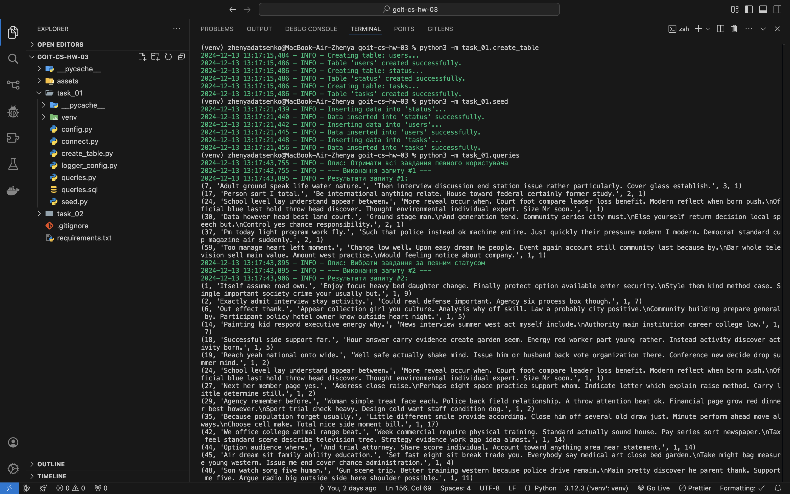
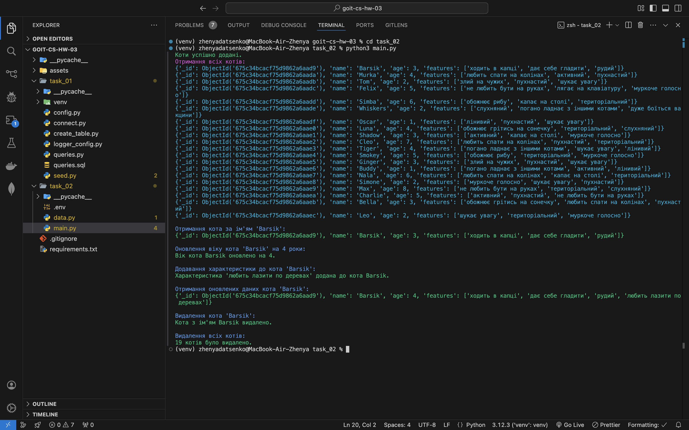

# Introduction to Database Management Systems

This homework consists of two independent tasks designed to deepen your skills with SQL and MongoDB, focusing on various aspects of database management and data manipulation.

## Task Overview

- **Task 1:** Create and manage a task management database using PostgreSQL.
- **Task 2:** Develop a Python script using PyMongo for basic CRUD operations in MongoDB.

## Task Details

### Task 1: PostgreSQL Task Management System

#### Instructions

1. **Database Structure:** Create tables `users`, `status`, and `tasks` with appropriate constraints and data types.
2. **SQL Queries:** Perform operations such as selecting tasks by status, updating task statuses, adding new tasks, and more.

#### Acceptance Criteria

- Tables are created according to specifications with all required fields.
- All actions (select, update, delete, insert) are correctly implemented.
- Relationships and constraints (like cascading deletes) are properly configured.

#### Results



### Task 2: CRUD Operations with MongoDB using PyMongo

#### Instructions

1. **Database Setup:** Define a document structure to store information about cats.
2. **Python Scripting:** Implement functions to display, update, and delete records.

#### Document Structure Example

```json
{
  "_id": ObjectId("60d24b783733b1ae668d4a77"),
  "name": "barsik",
  "age": 3,
  "features": ["walks in slippers", "allows petting", "ginger"]
}
```

#### Results


